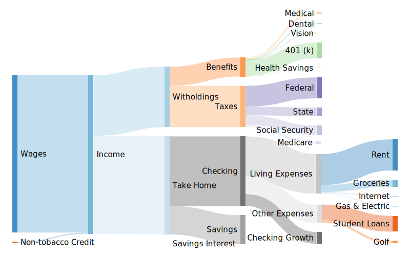

# [Budgeteer + SankeyMATIC][1]
A little website that combines the power of [budgeteer][4] and [SankeyMATIC][5] to help you balance your budgets.

[][1]

## Building blocks
* [Budgeteer][4] to automatically balance the budget flows
* [SankeyMATIC][5] to render the charts
* Microsoft's [monaco editor][6] to provide realtime coding assistance

## Other Info
* Check out my related [blog post][7].

# Author
Tanner Nielsen <tannerntannern@gmail.com>

[Website][2] | [GitHub][3]

[1]: https://budgeteer.tannernielsen.com
[2]: https://tannernielsen.com
[3]: https://github.com/tannerntannern
[4]: https://github.com/tannerntannern/budgeteer
[5]: http://sankeymatic.com
[6]: https://microsoft.github.io/monaco-editor/
[7]: https://blog.tannernielsen.com/2019/06/25/Budgeteer-A-Budget-Balancing-Tool/
